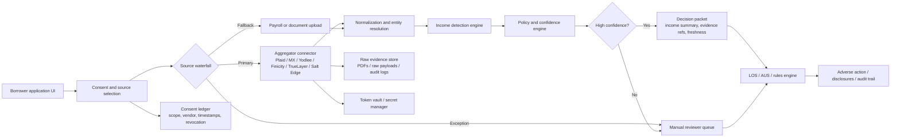
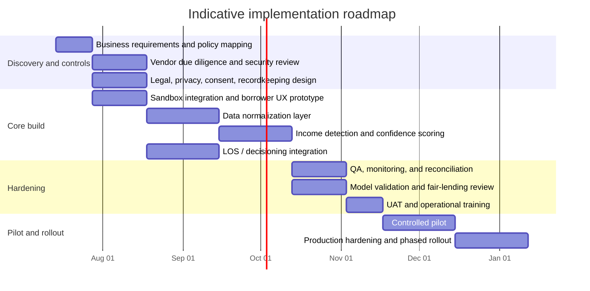

# Automated Income Evaluation Using Plaid and Other Account-Aggregation Providers

## Executive summary

For automated income evaluation, the strongest pattern in the market is **not** “replace all borrower documents with one bank-data API.” It is a **waterfall**: use consumer-permissioned bank-data aggregation first for structured transactions and account metadata; use exact bank-statement PDFs where available or required; use payroll/document uploads as fallback; and route unresolved edge cases to human review. That architecture aligns best with what the leading providers actually ship today. Plaid and MX are the clearest publicly documented options for retrieving bank-statement PDFs directly from institutions. Yodlee supports transactions, documents, and lender-facing JSON/PDF reporting; Finicity and TrueLayer are stronger in structured open-banking data and derived lending workflows than in public documentation of raw statement-PDF retrieval; Salt Edge offers broad account aggregation plus a PDF-based “Financial Insights” report, but that report is a derived artifact, not an exact bank-issued statement in the documentation reviewed. citeturn25view0turn25view4turn38view1turn26view4turn26view8turn36view2

From a lending-operations perspective, the opportunity is real. Published case studies show mortgage and adjacent verification workflows compressing materially when lenders switch from manual document collection/review to permissioned account access and machine-readable verification. Mastercard Open Finance reports up to **12 days** faster origination for mortgage verification workflows, and Guaranteed Rate reports **8+ days** faster loan processing after adopting Mastercard’s digital verification. Salt Edge’s Keysafe case study reports tenant-finance verification falling from **36 hours to about 4 minutes**. Those are marketing-side upper bounds, so a prudent underwriting organization should expect more modest but still meaningful results in production: roughly **30–70% lower manual-review effort**, **same-day decisions for the cleanest 40–70% of files**, and **substantially lower document-forgery exposure** in the connected-bank channel. citeturn18search1turn18search4turn21search20

The main reason implementations fail is not API connectivity. It is **income interpretation**. Raw bank transactions are noisy: transfers masquerade as income, gig deposits are irregular, spouses co-mingle funds, payroll can be split across accounts, and statement periods do not align neatly with underwriting periods. Even excellent aggregation and categorization still require an internal **income decisioning layer** with explainable rules, reconciliation logic, quality thresholds, confidence scoring, and escalation paths. Plaid explicitly markets derived bank-income streams and historical income; MX exposes enriched transactions and direct-deposit indicators; Yodlee and Salt Edge expose categorization and lender-oriented derived outputs. But no provider removes the need for lender-specific policy logic. citeturn25view1turn25view5turn38view2turn21search22turn19search12

Compliance is manageable but nontrivial. In the U.S., the CFPB’s personal financial data rights rule under Section 1033 is the clearest forward-looking baseline: consumer authorization, data-use limitation, revocation, and a general **one-year maximum** collection duration before reauthorization. GLBA/FTC Safeguards requirements mean lenders and service providers must run a written security program, encrypt data, control access, supervise vendors, and notify regulators of certain breaches. If the institution uses a **consumer report** or CRA-like derived report in underwriting, FCRA and adverse-action workflows apply; CFPB guidance also makes clear that complex models do **not** remove the obligation to provide specific adverse-action reasons. In the UK/EU, PSD2/Open Banking requires explicit AIS consent, while GDPR/UK GDPR add data minimization, storage limitation, DPIA obligations for high-risk scoring/profiling, and constraints around solely automated decisions with legal or similarly significant effects. citeturn14view0turn29view0turn29view1turn14view2turn14view3turn30view0turn28view2turn28view1turn28view3turn28view4

The recommended architecture for a lender is therefore a **policy-driven orchestration layer** in front of any single aggregator. That layer should normalize data from one or more vendors into a common schema, run income-detection and reconciliation logic, keep only the minimum raw data necessary, store tokens separately from underwriting artifacts, and produce an auditable decision packet for the LOS/AUS and compliance teams. For a mid-size lender with one LOS integration and a fairly standard underwriting policy, a realistic implementation window is about **four to seven months** to pilot; an enterprise rollout with multi-vendor routing, PDF/OCR fallback, model validation, and full compliance hardening is more often **six to ten months**. citeturn25view0turn25view5turn26view7turn34view1turn14view2turn28view0

## Provider capabilities and market comparison

The six providers reviewed solve overlapping but not identical problems. A lender choosing among them should distinguish between five different capability layers: **account linking**, **structured transaction access**, **exact statement retrieval**, **derived income/affordability analytics**, and **compliance/consent tooling**. Most vendor marketing blends these together; an implementation team should not. citeturn25view0turn25view5turn25view7turn26view4turn36view2

Plaid is unusually clear in public docs that it supports both **exact bank-branded PDF statements** and **derived income analytics from bank transactions**. The Statements product is U.S.-only and retrieves an “exact, bank-branded, PDF copy” directly from the bank. Plaid’s Bank Income product derives recent and historical net income and income streams from linked bank accounts, and its broader lending stack now includes FCRA-oriented consumer-report products for underwriting. Plaid also exposes explicit consent-event logs and consumer controls through Plaid Portal, including disconnect/delete functions. Operationally, Plaid documents coverage explorers, institution downtime/support views, webhook verification, and transaction refresh patterns. citeturn25view0turn25view1turn9search14turn25view2turn35view1turn33search2turn33search4

MX also publicly documents both **transaction aggregation** and **statement-PDF retrieval**. Its aggregation docs emphasize **90 days** of account and transaction data in the base pattern, more than **100 predefined categories**, and enrichment around merchant and direct-deposit/bill-pay/subscription signals. Its Statements capability retrieves **monthly account statements in PDF format**. MX’s positioning is especially strong on consumer-permissioned data access: it emphasizes OAuth/direct API tokenization, a consent dashboard, and revocation controls. Operationally, MX provides webhook infrastructure, explicit guidance on retries/duplicates, client dashboards, and a public product status page. citeturn25view4turn25view5turn25view6turn34view1turn34view0

Yodlee remains strong in broad aggregation and lender-oriented reporting. Public docs show up to **365 days** of transactions, support for U.S. open-banking OAuth connections through FastLink, consent objects with status/expiration metadata, and configuration of certain open-banking consent durations in some jurisdictions. Yodlee’s public materials also document **documents** and **user-uploaded PDF documents** in its account-verification stack, and its Credit Matrix product is explicitly designed for lenders to generate a borrower report in **JSON or PDF** for underwriting or credit review. What is less public in the docs reviewed is a Plaid-style or MX-style standalone “exact bank-issued statement PDF” product definition. citeturn25view7turn25view9turn25view8turn38view0turn38view1turn38view2

Finicity, now Mastercard Open Finance, is highly relevant for lending but is documented differently in public materials. Its strongest public position is on **verification of assets, income, and employment**, not on raw statement extraction as a standalone product. Mastercard’s lending materials emphasize **95% coverage of U.S. DDA accounts**, **90% coverage of U.S. payroll accounts**, GSE-approved mortgage verification, and up to **24 months** of income history in some verification products. Its market strength is clearest where the lender wants borrower-permissioned financial data converted into underwriting/verification outputs rather than stored as raw statements. In the public materials reviewed, pricing appears sales-led rather than self-serve. citeturn10search2turn18search1turn18search15turn18search17turn10search6

TrueLayer is the strongest of the group in regulated **UK/EU open-banking consent flows** and API-native access to structured data. Its Data API exposes identity, accounts, balances, transactions, and regular payments. Its public consent documentation is exceptionally explicit about regulated AISPs, the need for **explicit consent**, connection/authentication validity windows, and re-confirmation patterns; it also states that UK authentications are generally open-ended while consent must be reconfirmed at least every **90 days** to continue access. In the public docs reviewed, TrueLayer does **not** present raw bank-statement-PDF retrieval as a standard public Data API feature; instead it emphasizes structured data, affordability checks, and verification. citeturn26view4turn26view5turn26view6turn26view7turn37view0

Salt Edge is broadest geographically in the set reviewed and combines aggregation, enrichment, and compliance tooling. It documents **5,000+ banks** and **50+ countries**, licensed/partnered PSD2 connectivity, and an additional **Financial Insights** service that can produce **PDF reports** and is stored in the client dashboard for **one week**. Reconnect flows require new consent, and the platform can auto-refresh connections. For a lender, this is useful when the objective is “turn bank history into affordability/income insights” rather than “download the exact monthly bank statement the borrower sees.” citeturn36view0turn36view1turn26view8turn26view9turn36view3

| Provider | Core APIs and data | Statement/PDF support | Authentication and consent | Coverage and pricing model | Reliability and compliance signals |
|---|---|---|---|---|---|
| **Plaid** | Transactions, accounts, identity, income, assets, consumer-report underwriting modules. Transactions docs describe up to **24 months** of historical transaction data. citeturn25view1turn33search3turn19search4 | **Yes**: exact, bank-branded **PDF bank statements** in the U.S. citeturn25view0 | Link-based flows; OAuth where supported; consent-event API with up to **3 years** of consent logs; consumer disconnect/delete via Plaid Portal. citeturn25view2turn35view0turn35view1turn25view3 | 10,000+ institutions in U.S./Canada and 12,000+ globally in consumer-facing materials; pricing details routed through sales/support. citeturn11search2turn11search16turn35view1 | Institution health/downtime views; signed webhooks; refresh/webhook model documented. citeturn35view1turn33search2turn33search4 |
| **MX** | Account aggregation, enrichment, verification; base aggregation docs emphasize **90 days** and 100+ categories plus direct-deposit indicators. citeturn25view5 | **Yes**: monthly statements in **PDF** format. citeturn25view4 | Connect Widget or Platform API; tokenized direct API/OAuth; permissioned sharing and consumer consent dashboard. citeturn25view5turn25view6 | Tens of thousands of institutions; pricing appears sales-led/publicly nontransparent in reviewed docs. citeturn10search1turn40search1 | Public status page, dashboard metrics, broad webhook support with retry/security guidance. citeturn34view0turn34view1turn40search20 |
| **Yodlee** | Up to **365 days** of transactions; verification APIs; FastLink; lender-oriented Credit Matrix. citeturn25view7turn38view1 | **Partial / different**: user documents and Credit Matrix reports in **JSON/PDF** are documented; exact bank-issued statement-PDF positioning is less explicit in public docs reviewed. citeturn38view0turn38view1turn7search8 | FastLink manages OAuth and legacy credential-based flows; consent objects include status, scopes, expiration, revocation metadata. citeturn25view9turn25view8turn7search0 | Broad aggregation network; pricing appears enterprise/sales-led. citeturn39search2turn38view1 | Open-banking consent events/webhooks; provider uptime/status metadata in release notes. citeturn7search12turn38view2 |
| **Finicity / Mastercard Open Finance** | Strongest publicly in lending verification: assets, income, employment, account ownership, cash-flow analytics; up to **24 months** of income history in some flows. citeturn18search15turn18search17turn10search6 | **Mostly derived verification/reports** in public lending materials reviewed, rather than a clearly publicized raw statement-PDF product. citeturn18search1turn18search15turn18search19 | Consumer-permissioned connections via Mastercard Data Connect/Open Finance; public docs emphasize consent-first design. citeturn10search6 | U.S.-centric lending strength; **95%** U.S. DDA coverage and **90%** payroll coverage; pricing appears enterprise/demo-led. citeturn10search2turn18search15 | GSE acceptance and mortgage workflow depth are major reliability signals for lenders. citeturn18search1turn18search9 |
| **TrueLayer** | Identity, accounts, balances, transactions, standing orders, direct debits via a single Data API. citeturn26view4turn26view6 | **No public raw statement-PDF feature found** in reviewed Data API docs; focus is structured bank data and affordability/verification. citeturn26view4turn37view1 | Explicit-consent model under PSD2; connections represent consent + authentication; consent usually expires, UK reconfirmation typically every **90 days**. citeturn26view5turn26view7 | Primarily UK/EU; official materials say **95%+** coverage in major European markets; unlimited free sandbox/testing, then paid live usage. citeturn37view0turn37view2 | API-based only in UK/Europe, with emphasis on testing bank APIs and minimizing screen-scraping risk. citeturn37view0 |
| **Salt Edge** | Broad global account aggregation plus enrichment, merchant ID, and Financial Insights. citeturn36view0turn36view1turn36view2 | **Yes, but derived**: Financial Insights supports **PDF reports**; docs do not position this as an exact bank statement. Reports are stored for **1 week**. citeturn26view8turn8search0 | PSD2/AISP/PISP infrastructure; reconnect requires new consent; auto-refresh supported. citeturn26view9turn36view1 | 5,000+ banks, 50+ countries; quote-based pricing for Financial Insights and other sales-led services. citeturn36view3turn36view2 | Public API status page; ISO 27001 and PSD2 licensing highlighted. citeturn36view0turn36view3 |

Two practical conclusions follow from this comparison. First, if your underwriting process **must** preserve exact statement images for investors, auditors, or QC, the shortest path is usually **Plaid or MX first**, with Yodlee as a broader-document alternative and Salt Edge only when you are comfortable with a **derived insight PDF** rather than the source statement. Second, if your main goal is **income/affordability analytics** with explainable transaction-level evidence, Finicity, Plaid, TrueLayer, Yodlee, and Salt Edge are all viable, but the best fit depends heavily on geography and the degree to which your lending operation wants structured data versus vendor-generated reports. citeturn25view0turn25view4turn38view1turn36view2turn10search2turn26view4

## Real-world implementations and case evidence

The most credible production evidence is in mortgage and adjacent fintech workflows, where lenders are under pressure to reduce stips, shorten cycle times, and cut repurchase/QC risk without degrading fairness or borrower experience. Freddie Mac’s Loan Product Advisor **Asset and Income Modeler** automates assessment of borrower assets, income, and employment through verified service providers, and Fannie Mae’s **DU Validation Service** digitizes validation of assets, income, and employment, including using asset reports for income validation via deposit accounts. Those GSE integrations matter because they show that direct-deposit and permissioned-account data are no longer “alternative” in the fringe sense; they are now embedded in mainstream U.S. mortgage technology stacks. citeturn20search3turn20search7turn20search10turn20search6

Mastercard Open Finance has the most concrete public mortgage case studies. Its mortgage-verification product says it can cut origination time by **up to 12 days**, and its Guaranteed Rate study reports that the lender cut loan processing time by **8+ days** after adopting Mastercard digital verification. Intercoastal Mortgage says Mastercard’s credentialed payroll enhancement integrated smoothly into existing processes with no loan-processing workflow disruption and a more cost-effective experience. Tomo Mortgage states it is building a consumer-friendly verification waterfall with up to **24 months** of income history. These are vendor-authored sources and should be treated as directional, but they are still useful benchmarks for what is technically possible when the LOS and underwriting workflow are tightly integrated. citeturn18search1turn18search4turn18search11turn18search17

Plaid’s public evidence is more product- and workflow-oriented than customer-metric-heavy, but it is relevant. Plaid’s mortgage automation materials state that borrowers can share **up to two years** of transaction history, balance information, and ownership in a single connection, and that Plaid Assets supports Freddie Mac AIM for automated assessment using direct deposits. Plaid’s lending materials also emphasize real-time connected-bank underwriting, account-link conversion up to **80%** in lending flows, and cash-flow intelligence becoming available in as little as **10 seconds** in some product configurations. This is best read as proof that the tooling is mature enough for high-volume lender experiences, not as a guaranteed production KPI. citeturn18search12turn19search9turn19search4

TrueLayer’s public examples are especially useful for non-mortgage affordability and UK/EU flows. Its report on open-banking use cases says lenders can automatically verify and estimate income instead of collecting manual bank statements; it cites **Wagestream** verifying employee income, **Wollit** analyzing income to give users an “income promise,” **Zopa** using income and spending for loan-repayment affordability checks, and **CreditLadder** using account verification and transaction history to onboard users quickly and prevent fraud. This is not direct mortgage-underwriting evidence, but it is strong evidence that structured bank-data affordability models are live in consumer-finance products. citeturn23view0turn24view1turn37view1

Salt Edge publishes two of the clearest operational case metrics outside traditional lending. Credit Hero says Salt Edge gave it access to real-time data to automatically verify identity, account number, income sources, and balances. Keysafe reports that open-banking verification reduced response time from **36 hours** to about **4 minutes**. These are not mortgage examples, but they show what happens when a workflow moves from manual document collection to real-time permissioned bank access with enrichment. citeturn21search13turn21search20

Yodlee’s strongest public lender case is structural rather than metric-heavy: its **Credit Matrix** product exists specifically so consumers can link accounts and create a lender-consumable underwriting report in JSON or PDF. That matters because it shows a mature pattern where account aggregation is used not only for raw transaction access but also to generate an underwriter-friendly artifact. citeturn38view1

| Implementation | What was automated | Published result or implication |
|---|---|---|
| **Freddie Mac AIM** | Automated assessment of borrower assets, income, and employment via service providers. citeturn20search3turn20search11 | Shows mainstream mortgage acceptance of direct-deposit/account-data-based verification. citeturn20search3turn20search7 |
| **Fannie Mae DU Validation Service** | Digital validation of assets, income, and employment, including income validation via asset reports on deposit accounts. citeturn20search10turn20search6 | Supports lower-document mortgage processing when lender uses approved vendors and borrower consent. citeturn20search2turn20search14 |
| **Guaranteed Rate + Mastercard Open Finance** | Digital mortgage verification. citeturn18search4 | Reported **8+ days** faster loan processing. citeturn18search4 |
| **Mastercard Mortgage Verification Service** | One-touch mortgage verification of assets/income/employment. citeturn18search1turn18search13 | Reported capability to cut origination by **up to 12 days**. citeturn18search1 |
| **Tomo Mortgage + Mastercard** | Verification waterfall for income/assets handling. citeturn18search17 | Public focus on more complete borrower income view with up to **24 months** of history. citeturn18search17 |
| **Wagestream / Wollit / Zopa via TrueLayer** | Income verification and affordability checks from open-banking data. citeturn24view1 | Demonstrates live fintech use of transaction-derived income/affordability rather than manual statements. citeturn24view1 |
| **Credit Hero + Salt Edge** | Automatic verification of identity, account number, income sources, balance. citeturn21search13 | Strong example of replacing manual applicant evidence with real-time financial data. citeturn21search13 |
| **Keysafe + Salt Edge** | Tenant financial verification workflow. citeturn21search20 | Response time reduced from **36 hours** to about **4 minutes**. citeturn21search20 |

The right takeaway from these cases is not that every lender will immediately save a week. It is that **the ceiling is high**, but realized value depends on three variables: borrower adoption of connected-bank flows, fit between provider capabilities and policy requirements, and the quality of the lender’s internal decisioning and exception-handling layer. Vendor case studies show speed; GSE integrations show legitimacy; your underwriting logic determines production yield. citeturn18search1turn18search4turn20search3turn20search10

## Compliance, legal, privacy, security, and vendor-risk issues

The most useful U.S. regulatory reference point is the CFPB’s personal financial data rights rule. The rule requires data providers to make covered data available to consumers and authorized third parties, sets obligations for third parties, and limits third-party collection, use, and retention to what is reasonably necessary to provide the consumer’s requested product or service. Critically for lenders and aggregators, the rule caps the duration of covered-data collection at **one year after the consumer’s most recent authorization**, after which new authorization is required. It also requires record retention evidencing compliance for at least **three years**. Even if a lender’s current use case falls partly outside the rule’s scope or timeline, it is the clearest design pattern for U.S. consent management: purpose-specific, revocable, time-bounded, and minimization-oriented. citeturn14view0turn14view1turn29view0turn29view1turn29view3

GLBA and the FTC Safeguards Rule are unavoidable for mortgage lenders, finance companies, and many service providers. The rule requires a written information security program with administrative, technical, and physical safeguards; access control review; encryption in transit and at rest; MFA; risk assessments; secure application procedures; and vendor oversight. It also requires certain institutions to notify the FTC within **30 days** of discovery of a qualifying notification event affecting at least **500 consumers’** unencrypted information. If borrower bank data is flowing through an aggregator, your institution remains responsible for ensuring the provider protects that information in your care. citeturn14view2turn14view3

Fair lending and adverse-action risk sit on top of privacy/security risk. If the lender relies on a **consumer report** or CRA-like underwriting product, FCRA adverse-action rules apply, and if it uses income or cash-flow models in credit decisions, ECOA/Regulation B specific-reason requirements still apply. The CFPB’s 2022 circular makes clear that complex algorithms do **not** justify vague explanations such as “failed to achieve a qualifying score.” Reasons must be specific and reflect the factors actually considered. Plaid’s consumer-report underwriting product is expressly marketed as FCRA-compliant. Yodlee’s lender product is offered through **Yodlee Credit LLC**, which is a signal that some implementations may be built as report products rather than purely first-party analytics. In practice, most lenders should assume that income models need to be auditable and explainable regardless of whether the exact data path triggers FCRA. citeturn30view0turn14view4turn9search14turn38view1

State privacy and cybersecurity obligations still matter even where GLBA applies. California’s breach-notification law requires notice to affected California residents when unencrypted personal information is acquired or reasonably believed to have been acquired by an unauthorized person. California’s broader privacy regime has only a **data-level**, not complete entity-level, GLBA carveout, so marketing and ancillary data uses can still create state-law obligations outside classic GLBA use. In New York, the DFS cybersecurity program requires MFA based on risk, encryption, and vendor-management controls for third parties handling nonpublic information. For multi-state lenders, that means the vendor-risk program for a bank-data aggregator cannot be lightweight. citeturn15search3turn15search10turn16search2turn16search4turn28view0

For UK/EU flows, the requirements are stricter and clearer. TrueLayer’s own consent documentation states that **explicit consent** is a regulatory requirement for AISPs under PSD2 in the UK and EU. Separately, UK GDPR and GDPR require data minimization and storage limitation, and the EDPB says a DPIA is required where processing is likely to result in high risk, including systematic and extensive evaluation or scoring based on automated processing where decisions produce legal or similarly significant effects. That captures many automated income/affordability decisioning systems. If a lender uses bank-data profiling for automated credit outcomes in the UK/EU, it should expect to document a lawful basis, perform a DPIA, define retention, and provide meaningful governance around automated decision-making and human review. citeturn26view5turn26view7turn28view2turn28view1turn28view3turn28view4

Vendor management should therefore cover more than security questionnaires. At minimum, the lender should require: subprocessor transparency; documented consent/revocation controls; breach-notification SLAs; evidence of encryption and key-management practices; audit/SOC/ISO artifacts; business-continuity and disaster-recovery evidence; webhook authenticity mechanisms; status-page or incident transparency; model-change notices where enrichment/categorization changes affect decisions; and contractual obligations to delete or return data on termination. NYDFS’s 2025 third-party guidance is blunt: firms must regularly analyze the sufficiency of controls used to manage third-party risk. citeturn28view0turn34view0turn34view1turn33search5turn36view3

## Technical challenges, model risk, and failure modes

The hard part is not connecting a bank account. It is turning noisy payment rails into **underwriting-grade income evidence**. Transaction strings are messy, posting dates shift, webhooks arrive asynchronously, and the same deposit pattern can mean salary, self-employment receipts, reimbursement, tax refund, transfer from another owned account, or fraud. Vendor enrichment helps, but it does not eliminate lender-specific policy logic. Plaid’s own product evolution is instructive here: it now combines classified transactions with payroll and document benchmarks to “validate income quality and consistency,” which implies that pure transaction patterning alone is not enough even for an aggregator selling this capability. citeturn19search12turn25view5turn38view2

A production-grade income engine usually needs at least six layers of logic. The first is **normalization**: unify provider-specific account, transaction, category, pending/posting, and balance semantics. The second is **entity resolution**: group internal transfers and linked accounts so the same money is not double-counted. The third is **income candidate detection**: recurring ACH/payroll signatures, merchant/payor fingerprints, deposit regularity, and exclusion of non-income patterns such as cash advances, P2P sweeps, or loan proceeds. The fourth is **policy application**: minimum history, recency, continuity, income-type treatment, instability discounts, and large-deposit rules. The fifth is **confidence scoring** so only strong cases auto-pass. The sixth is **reconciliation and explainability**, so the system can tell an underwriter exactly why it counted or rejected a deposit stream. citeturn25view1turn25view5turn19search12turn20search4turn20search5

PDF statements add a separate problem set. They are useful for QC, exact-document retention, and fallback coverage, but OCR on bank statements produces its own tech debt: table-detection errors, invisible characters, truncated descriptions, multi-column misreads, and statement-period ambiguity. If the statement image is the source of truth, you must reconcile OCR-extracted transactions back to statement totals and page-level evidence. If aggregated transactions are the source of truth and PDFs are just a substantiating layer, then OCR should be used sparingly and only where structured bank-data coverage is absent or challenged. Plaid and MX reduce this problem by letting lenders retrieve PDFs directly from banks; that is better than asking borrowers to upload screenshots or scanned printouts, but it still does not remove the need for PDF storage, document QA, and retention controls. citeturn25view0turn25view4

Latency and freshness are also commonly underestimated. Plaid notes that transaction refresh frequency varies by institution and is typically one or more times per day, with on-demand refresh available as an add-on; its first `/transactions/sync` historical call can have materially higher latency than simple fetches. Yodlee warns that larger transaction aggregation windows increase latency. MX explicitly warns developers not to rely on webhooks alone in UX and to expect duplicates/retries. In practice, that means the lender’s system needs a **freshness SLA** per use case. A point-of-sale lender may need “same-session enough” data; a mortgage lender may accept a batchy model if it is auditable and comprehensive. citeturn33search4turn33search8turn25view7turn34view1

The highest-risk edge cases are consistent across providers: new job with insufficient history; split payroll across multiple banks; seasonal/commission/gig income; joint accounts with multiple earners; cash-heavy workers; military/government pay descriptors that change; employer payroll processors switching IDs; statement periods that clip payday cycles; tokenized account numbers; borrowers unlinking or needing MFA mid-flow; and institution outages or consent expiration. Yodlee documents tokenized account-number differences at some U.S. open-banking sites, which shows how even “account number” itself can become semantically unstable. citeturn38view2turn25view8turn33search6

The failure modes and the corresponding mitigations are straightforward in concept, but not cheap in implementation:

| Failure mode | Why it happens | Practical mitigation |
|---|---|---|
| False-positive income from transfers, P2P, refunds, or loan proceeds | Deposit text is ambiguous; internal transfer graph missing | Build owned-account transfer detection, merchant/payor clustering, and exclusion rules before applying recurrence logic. citeturn25view5turn19search12 |
| Missed legitimate income | Employer/payroll IDs change; gig income irregular | Use sequence-based clustering, broader recency windows, and policy-backed manual review for low-confidence streams. citeturn25view1turn19search12 |
| Data too stale for decisioning | Providers refresh on different cadences; webhooks delayed | Add explicit freshness checks, on-demand refresh where supported, and timeout/fallback logic. citeturn33search4turn34view1 |
| PDF/OCR mismatch | OCR/table extraction errors | Reconcile OCR output to statement totals and keep page-level exception review. citeturn25view0turn25view4 |
| Borrower drop-off in linking flow | MFA/OAuth friction, unclear consent copy | Shorten scopes, preselect relevant accounts, use institution-status monitoring, and keep a document fallback. citeturn26view5turn35view1turn34view0 |
| Consent expiration or borrower revocation | Regulatory time limits and consumer controls | Store consent metadata, poll events, and build re-consent journeys before loan renewal/reverification. citeturn25view2turn26view7turn29view0 |
| Institution outage or degraded connectivity | Bank API failures, provider-specific incidents | Multi-vendor fallback for high-value channels, status-page health routing, and manual fallback queue. citeturn35view1turn34view0turn38view2turn36view0 |

A lender that tries to “solve” these issues only with vendor selection usually accumulates tech debt. The right posture is to assume provider data is **valuable but imperfect**, and to invest in internal observability: per-institution success rate, incomplete-history rates, override rates by rule, false-positive/false-negative appeals, and adverse-action reason distributions. If the organization cannot measure those, it cannot govern the model. citeturn34view1turn35view1turn30view0

## Expected benefits, economics, and a realistic operating model

The benefit case is strongest when the lender is currently reliant on emailed PDFs, portal uploads, or manual underwriter review of multiple statements per borrower. In that state, automation can improve **speed**, **labor consumption**, **data quality**, and **fraud exposure** all at once. The most visible benefit is cycle-time reduction: published case studies show anything from minutes instead of hours in simpler affordability checks to multi-day savings in mortgage verification. A realistic lender should not budget around the maximum marketing claims, but it also should not ignore them; they show the boundary conditions of what good integration can achieve. citeturn18search1turn18search4turn21search20

The following operating ranges are reasonable for a mid-size consumer or mortgage lender **if** connected-bank adoption is decent, LOS integration is competent, and policy automation is limited to well-understood income types. These are synthesis ranges, not vendor promises.

| Metric | Conservative range | Stretch range | Main assumptions |
|---|---:|---:|---|
| Manual analyst time removed per bank-statement package | **10–25 min** | **25–45 min** | Clean files move straight through connected-bank verification; exceptions still reviewed manually. Supported directionally by mortgage and tenant-verification case studies. citeturn18search4turn21search20turn18search1 |
| End-to-end verification cycle-time reduction | **30–60%** | **60–85%** | Strongest where borrower no longer has to upload/re-upload documents and where decisioning is near-real-time. citeturn18search1turn18search4turn21search20 |
| Data-entry / transcription defects from manual review | **40–70% lower** | **70–90% lower** | Assumes structured transactions replace manual keying for most cases; enrichment errors still exist. citeturn25view5turn25view1 |
| Document-forgery exposure in the automated channel | **Meaningfully lower** | **Much lower** | Best when exact bank-linked data replaces user-supplied screenshots/PDFs; residual risk remains for fallback channels. citeturn19search1turn25view0 |
| Per-application labor savings | **$6–$25** | **$25–$45** | Illustrative only. Assumes 10–45 minutes saved and fully loaded operations cost of roughly $35–$60/hour. |
| Approval/booking uplift from less friction | **Low single digits** | **Mid single digits** | Depends heavily on borrower linking conversion and fallback quality. Plaid cites up to **80%** account-link conversion in lending flows as a signal that friction can be manageable. citeturn19search4 |

For a quick intuition, the economics usually work when three conditions are met. The lender has enough application volume that analyst minutes matter. The borrower funnel is digital enough that account linking does not create a new abandonment cliff. And the organization uses the data in more than one place: underwriting, fraud detection, ACH setup, ongoing monitoring, QC, or recapture. If the lender only wants to replace a few PDF uploads and changes nothing else, the ROI is thinner. citeturn19search1turn10search6turn21search0

The strongest cost argument is usually **not** “the API is cheaper than statements.” It is “the combination of fewer manual touches, fewer re-requests, lower fraud, and cleaner downstream data is worth more than the vendor fee.” That is why the best use cases look like a stack, not a single point solution: connect once, then reuse the permissioned data for account verification, affordability, income analysis, reserve verification, and funding/payment setup. Providers themselves increasingly market this stackable model. citeturn18search1turn18search15turn10search6turn21search0

## Recommended architecture and implementation roadmap

The recommended target-state architecture is a **decisioning platform**, not a thin API client. The aggregator should sit behind an internal orchestration layer that controls vendor routing, scopes, consent storage, retries, data normalization, confidence scoring, and retention. That prevents vendor lock-in, reduces policy fragmentation, and makes it possible to swap or add a second provider for coverage or resiliency without rewriting the underwriting workflow. citeturn26view7turn34view1turn35view1

A strong default pattern is: connected-bank aggregation as primary source, statement PDF capture where needed, payroll/document upload as fallback, and manual review only for unresolved exceptions. The underwriting system should consume a **decision packet** rather than raw vendor payloads. That packet should include normalized account summaries, identified income streams, stability flags, confidence score, freshness timestamp, policy notes, and links to supporting evidence. Raw data should remain in a segregated, short-retention evidence store; tokens and secrets should live in a separate vault; LOS should receive only what it needs. That design aligns with data minimization and simplifies deletion/revocation handling. citeturn28view2turn28view1turn29view1turn25view3

A realistic roadmap for a mid-size lender looks like this:

In staffing terms, a credible pilot usually needs roughly **2–4 backend/integration engineers**, **1 frontend or embedded-UX engineer**, **1 data engineer**, **0.5–1 data scientist or quantitative analyst**, **1 QA/SDET**, plus part-time support from product, compliance/legal, security/GRC, and lending operations. If the lender also wants a PDF/OCR fallback, multi-vendor routing, GSE delivery, or consumer-report integration, that staffing and duration increases materially. The common mistake is underfunding the non-engineering work: consent copy, adverse-action reason mapping, QA gold datasets, and model-governance documentation. citeturn34view1turn14view2turn30view0turn28view3

The most effective milestone sequence is:

| Milestone | Estimated duration | Exit criteria |
|---|---:|---|
| Provider shortlisting and due diligence | 3–5 weeks | Security, legal, coverage, and product-fit review complete; target commercial terms identified. |
| Sandbox proof of concept | 2–4 weeks | Successful account linking, account selection, transaction pull, and basic evidence capture. |
| Normalization plus eligibility rules | 4–8 weeks | Common schema works across at least one provider and one major fallback path; first-pass explanations available. |
| LOS integration and exception routing | 3–6 weeks | Decision packet lands in underwriting flow; reviewers can override and annotate. |
| QA, control testing, and governance | 3–6 weeks | Reconciliation, freshness, revocation, deletion, and disclosure controls pass test cases. |
| Pilot | 4–8 weeks | Stable borrower completion, review-rate, and error-rate metrics; no unresolved severe compliance gaps. |
| Scaled rollout | 4–8 weeks | Institution routing, dashboards, SLAs, and vendor-management routines are live. |

The architecture recommendation is therefore simple: pick one provider to start, but design so the **lender owns the policy brain**. That is the only durable way to avoid replatforming costs later. citeturn26view7turn34view1turn35view1

## Bottom line

If the objective is to automate borrower bank-statement intake for income evaluation, the best current answer is **not** a single provider and not a single data type. It is a governed, multi-source, consumer-permissioned workflow in which structured bank data is the primary evidence, exact statement PDFs are used where the business needs image fidelity, and human review is reserved for ambiguous cases. In the U.S., Plaid and MX are the clearest publicly documented fits for direct statement-PDF access; Finicity is especially compelling for mortgage-grade verification and GSE alignment; Yodlee is strong where lender-facing JSON/PDF reporting matters; TrueLayer is most attractive for UK/EU explicit-consent open-banking workflows; and Salt Edge is strongest where geographic breadth and derived affordability reports matter. citeturn25view0turn25view4turn18search1turn38view1turn26view5turn36view2

For a lender, the decision should be driven by five questions. Do you need exact statement images or only structured account history? Are you U.S.-centric or UK/EU-centric? Do you want raw data or vendor-generated verification reports? Can your legal/compliance stack support consumer-report obligations if needed? And are you willing to build the internal income-decisioning layer that separates “interesting transaction data” from “underwriting-grade evidence”? If the answer to the last question is no, the implementation will create more exceptions than it closes. If the answer is yes, the economics and borrower-experience upside are strong enough to justify serious investment. citeturn29view0turn14view2turn30view0turn28view3turn20search3turn20search10