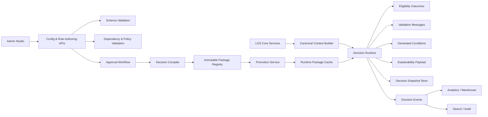
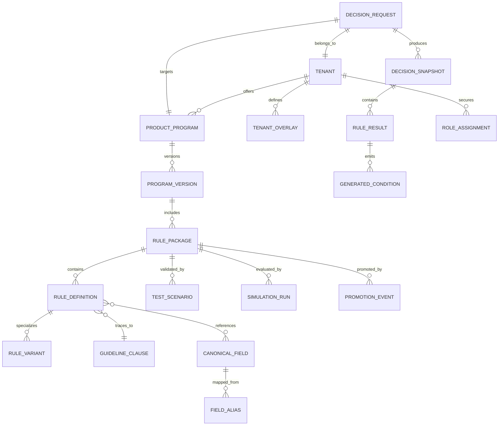

# Enterprise Architecture for a Multi-Tenant SaaS Loan Origination Platform

## Executive summary

For an enterprise-grade, multi-tenant SaaS Loan Origination platform, the two capabilities you called out should be designed as **separate but tightly coupled platforms**: a **Configuration Platform / Admin Studio** for safe tenant customization, and a **Decision & Rules Platform** for guidelines, eligibility, validation, and condition generation. They should share a **canonical data dictionary**, a common release pipeline, and immutable versioned artifacts. Treating these as first-class platforms is more robust than scattering configuration tables through application services or exposing a vendor’s native rule authoring UI directly to lender admins. AWS’s SaaS guidance is explicit that isolation is foundational and should not be left to individual service developers; Microsoft’s multitenancy guidance similarly frames isolation as a spectrum with deliberate tradeoffs between cost, performance, reliability, and regulatory demands. citeturn34view0turn34view2turn26view1

The strongest architectural pattern for this problem is a **tenant-aware control plane plus stateless runtime plane**. In the control plane, admins edit typed configuration objects, rule packages, field mappings, and theme/layout settings through guarded workflows with schema validation, dependency checks, approvals, draft/publish, effective dates, and promotion across environments. In the runtime plane, origination services call a **Decision Runtime** that evaluates immutable packages against a normalized request context and returns structured results, explanations, and generated conditions. JSON Schema is a strong fit for validating configuration envelopes, and both AWS AppConfig and Azure App Configuration demonstrate the practical value of schema validation, labels/variants, revisions, staged rollout, and rollback as configuration-safety primitives. citeturn26view4turn27view2turn27view3turn27view4

For the decisioning layer, the best long-term design is **standards-inspired but product-owned**. DMN and FEEL remain the clearest public standard for business-readable decision logic, and they are widely supported across Camunda, Drools/Red Hat, IBM ODM, and FICO ecosystems. But the platform should still own its own authoring UX and internal rule AST so that lender admins are editing **guardrailed business concepts**, not raw engine internals. Large rule systems become difficult to manage when they are not factored and normalized; the decision-table literature, DMN-complexity research, and enterprise docs from Red Hat and IBM all point toward verification, simulation, and modularization as essential controls. citeturn10search3turn26view6turn36view0turn8search10turn9search11turn9search12turn30view2turn26view5

The platform should also use a **MISMO-aligned canonical field registry**. MISMO’s reference model, logical data model, and logical data dictionary exist precisely to give mortgage participants a common language across technologies, and MISMO now supports both XML and JSON-oriented implementations. For a SaaS LOS, that means every authorable rule should reference canonical field identifiers, not source-system column names, and every inbound integration should translate into that canonical vocabulary before decisioning occurs. citeturn24search0turn26view2turn24search2turn24search10

My concrete recommendation is to build a **custom Admin Studio and Decision Package Registry on top of relational control-plane metadata plus immutable package blobs**, then choose the execution substrate based on the organization’s operating model. If you want maximum product control and external tenant self-service, use a custom DSL/AST with a DMN/FEEL-like authoring experience and either a JVM execution core or a constrained standards-compliant decision engine underneath. If the organization already has IBM ODM or FICO capability, those are strong enterprise decision-management products, but they are better used behind a SaaS-specific control plane than exposed directly to each tenant. OPA is excellent for narrow technical-policy domains and audit logging, but it is materially weaker for lender-facing no-code authoring. AWS Step Functions and Azure Logic Apps are useful orchestration companions, not primary business-rules systems. citeturn23search16turn26view5turn23search18turn32view2turn28view2turn28view1turn26view7turn29view1turn29view0

## Scope and assumptions

This report assumes a platform that serves multiple lender tenants in a shared SaaS environment, but several key constraints were left open: tenant count and size distribution, latency SLOs, concurrency targets, regulatory scope, geographic footprint, and whether some tenants require hard infrastructure isolation. Those open variables materially affect database partitioning, deployment topology, and whether some tenants should remain in a pooled model versus bridge or silo patterns. AWS and Microsoft both document these tradeoffs clearly: pooled designs improve cost efficiency and operational simplicity, while more isolated models improve tenant-specific control and regulatory fit at materially higher operational cost. citeturn26view0turn34view2turn26view1

A second working assumption is that “customization” does **not** mean arbitrary code, HTML, CSS, or free-form scripting. Safe customization should mean controlled changes to **themes, branding tokens, workflow options, required fields, product parameters, guideline content, rule overlays, document/condition templates, and integration mappings** inside typed schemas. That is consistent with the way modern configuration platforms emphasize validation, staged rollout, revisions, and approvals instead of unconstrained editing. citeturn27view2turn26view4turn27view0turn27view1

A third assumption is that mortgage-domain interoperability matters. MISMO positions its standards as a common language across the mortgage ecosystem, and its logical data model is explicitly business-centric and technology-agnostic. That makes MISMO the right external anchor for the platform’s canonical dictionary, even if the internal domain model simplifies and renames concepts for product usability. citeturn24search0turn26view2turn24search2

## Reference architecture

The cleanest system decomposition is to separate **control-plane configuration management** from **runtime decision execution**, while keeping both on a shared policy of tenant isolation and immutable releases. In practice, that means lender admins never edit production runtime state directly. They edit drafts in the control plane, the platform validates and compiles those changes into versioned packages, and only published packages become executable. That pattern aligns with enterprise decision products such as IBM Decision Center, Red Hat Business Central/KIE Server, and AWS Step Functions versions/aliases, all of which distinguish authoring from execution and support explicit release/version concepts. citeturn23search10turn23search16turn30view0turn30view4turn26view7



The control plane should be organized into bounded contexts with crisp ownership:

| Bounded context | Primary responsibility | Owns |
|---|---|---|
| Tenant & Identity | tenants, users, roles, environment scopes, entitlements | tenant metadata, role assignments |
| Canonical Data Registry | field dictionary, aliases, mappings, value domains | canonical fields, source mappings |
| Configuration Registry | product/program parameters, UI settings, templates | versioned config objects |
| Decision Authoring | guideline clauses, rules, overlays, simulations, tests | authoring artifacts, ASTs, scenarios |
| Package Registry | immutable compiled releases | release manifests, package hashes |
| Decision Runtime | evaluation against request context | runtime cache, evaluation traces |
| Audit & Analytics | immutable audit, search, metrics, replay feeds | snapshots, events, derived datasets |

This decomposition matters because it prevents the most common SaaS failure mode in policy-heavy systems: a single “rules service” turning into a monolith that owns everything from product setup to runtime orchestration. Capital One’s public discussions of DMN and BPM products are useful here: DMN is best when you need readable, reusable business decisions; orchestration is a different concern and should stay distinct. citeturn36view0turn36view2

### Service boundaries and data tenancy

For the **control plane**, a **pooled relational model with row-level tenant isolation** is usually the best default. PostgreSQL and Azure SQL both support row-level security, and AWS’s PostgreSQL SaaS guidance explicitly recommends RLS in pooled models to centralize isolation and keep isolation logic out of application code. That is especially important for config, rule metadata, and authoring artifacts, where you want strong central governance without a database explosion. citeturn20search0turn20search2turn20search8turn26view1

For **tenant deployment topology**, use a **hybrid partitioning model**. AWS formalizes the familiar **silo, bridge, and pool** choices for SaaS PostgreSQL. The right pattern for this LOS is: pooled by default, bridge for very large tenants or regional isolation needs, and silo only where customer-specific compliance or key-management demands force it. Microsoft’s guidance similarly recommends mixing shared and dedicated deployments across a continuum rather than forcing a single model on every customer. citeturn26view0turn34view2

For the **runtime plane**, keep decision evaluation services stateless and horizontally scalable. Package version, tenant context, and effective date should determine which compiled artifact is loaded; no mutable authoring state should leak into the evaluator. This is the same basic release discipline that Step Functions versions/aliases and deployment slots in Azure Logic Apps bring to workflow deployment. citeturn26view7turn19search12turn19search1

### Domain model

The platform’s domain model should distinguish human-readable policy intent from executable logic and from runtime evidence. That is the key to unifying guidelines, eligibility, validation, and condition generation without hardcoding them into application services.



The important modeling choice is that **GuidelineClause** and **RuleDefinition** are linked but not identical. A guideline may map to one or more executable rules, and a single executable rule may support multiple human-readable clauses, especially when one canonical test is reused across products or states. This traceability pattern is consistent with DMN’s separation of decision requirements and executable expressions, with IBM’s distinction between decision artifacts and deployment/release governance, and with MISMO’s insistence on a business-centric language separate from technology format. citeturn10search3turn31view1turn23search16turn26view2

## Configuration platform and Admin Studio

The Configuration Platform should behave less like a generic CMS and more like a **typed product-control surface**. The goal is to let an admin strongly customize behavior and presentation while making it hard to create invalid states. AWS AppConfig’s use of validators, staged deployment, and automatic rollback; Azure App Configuration’s use of stable keys plus labels and revisions; and LaunchDarkly’s approval and change-history features all point in the same direction: robust configuration systems are **schema-governed, versioned, auditable, and promotion-driven**. citeturn27view2turn26view4turn27view3turn27view4turn27view0turn27view1

A strong Admin Studio should support these editing modes:

- **Brand and theme editing** through design tokens only.
- **Workflow and product setup** through typed schemas and wizards.
- **Field registry and mapping management** through canonical-field binding screens.
- **Rule and guideline management** through business-readable tables/forms.
- **Diff, impact preview, simulation, and promotion** before publish.

What it should not allow is arbitrary code execution, raw DOM/script injection, or unconstrained SQL-like logic. AWS’s SaaS guidance is blunt that isolation should not be delegated to service developers; the same principle applies here to customization safety. If a customization can bypass shared policy enforcement, it is not a customization feature, it is a platform escape hatch. citeturn34view0

### Guardrails and lifecycle controls

At minimum, every editable configuration object should carry these control-plane fields: `tenant_id`, `object_type`, `schema_version`, `draft_revision`, `published_revision`, `effective_from`, `effective_to`, `environment`, `approval_state`, `package_reference`, `depends_on`, and `change_reason`. JSON Schema 2020-12 is well suited to validating structural constraints, while semantic checks should run in a second validation pass for dependency integrity, circular reference detection, field existence, and allowed enum/value domains. citeturn26view3turn26view4

A publish pipeline should enforce the following progression: **draft → validate → simulate/test → approve → publish → effective date activation → promote**. IBM ODM’s governance model of decision services, releases, branches, and activities is the closest public enterprise analogue; LaunchDarkly’s approval requirements and change history are a useful companion pattern for safer change management. citeturn26view5turn23search16turn27view0turn27view1

### Canonical data dictionary strategy

A mortgage LOS should not let each tenant author rules against whichever raw field names happen to exist in their inbound integrations. The platform should maintain a **canonical field registry** that maps source-system attributes into a normalized vocabulary, ideally anchored to MISMO concepts where they exist. MISMO’s reference model and logical data model were built specifically to make mortgage data business-centric and interoperable across technologies, including JSON-oriented implementations. citeturn24search2turn26view2turn24search10

Illustrative canonical field registry:

| Canonical key | Business meaning | Type | Standard anchor | Source aliases | Sensitivity | Nullable | Used by |
|---|---|---|---|---|---|---|---|
| `borrower.primary.creditScore.median` | Representative borrower score for policy tests | integer | MISMO Borrower / Credit | `fico_mid`, `mid_score`, `credit.median` | Confidential | Yes | eligibility, pricing, conditions |
| `loan.requestedAmount` | Requested original principal balance | decimal(18,2) | MISMO Loan Detail | `loan_amt`, `note_amount_req` | Confidential | No | eligibility, validation |
| `loan.purpose` | Purchase, rate/term, cash-out, etc. | enum | MISMO Loan Purpose | `purpose_code`, `refi_type` | Internal | No | eligibility, workflow routing |
| `property.subject.state` | Subject property jurisdiction | string(2) | MISMO Property / Address | `prop_state`, `collateral.state` | Internal | No | state overlays, disclosures |
| `underwriting.occupancyType` | Primary, second home, investor | enum | MISMO Property / Occupancy | `occ_type`, `occupancy` | Internal | No | eligibility, conditions |
| `document.appraisal.status` | Appraisal lifecycle state | enum | MISMO Appraisal / Document | `appraisal_status`, `valuation.state` | Internal | Yes | condition generation |

This registry should also store **value-domain definitions**, **alias mappings**, **lineage**, **deprecation policy**, and **rule-reference counts** so the platform can perform impact analysis before a field changes. That is the practical mechanism that bridges your concern about “guidelines” and “validation rules”: both reference the same canonical field contracts instead of inventing separate data vocabularies. MISMO’s logical data dictionary and unique ID-oriented artifacts are useful precedents for this kind of stable metadata discipline. citeturn24search6turn24search10turn24search11

### Configuration platform comparison

The table below is intentionally narrow: it evaluates how useful publicly documented configuration platforms are as **building blocks** for your Admin Studio, not whether they should replace it.

| Platform | Strongest documented capabilities | Multi-tenant support view | Validation | Versioning / promotion | Approvals / audit | Best use in this architecture | Sources |
|---|---|---|---|---|---|---|---|
| AWS AppConfig | Feature flags, freeform config, validators, deployment strategies, CloudWatch-backed rollback | Good namespace model for apps/environments, but not a lender-facing multi-tenant studio by itself | JSON Schema and Lambda validators | Configuration profiles, deployments, version labels, staged rollout | CloudTrail audit, monitoring, rollback | Delivery plane for approved runtime config, not primary authoring UX | citeturn27view2turn26view4turn12search1turn12search3turn11search22 |
| Azure App Configuration | Centralized key-values, labels, prefixes, revisions, feature flags | Good for environment and app variations; tenant semantics must be modeled by key/label conventions | Structural validation is weaker than AppConfig; combine with external schema checks | Labels and revisions support variants and rollback windows | Revision history exists, but retention is tier-limited | Good backing store for delivery/config lookup, not full policy governance | citeturn27view3turn27view4turn22search4turn22search11 |
| LaunchDarkly | Runtime control, approvals, change history, progressive release | Strong environment/project segmentation; still not a mortgage-domain authoring system | Flag-level rules rather than rich schema governance | Strong progressive delivery and rollback workflow | Native approvals and extensive change history | Excellent operational safety layer for controlled rollout of features/config switches | citeturn27view0turn27view1turn21search23 |

The design conclusion is straightforward: these products are useful **operational safety companions**, but none should be the full tenant-facing Admin Studio for a loan origination SaaS. You still need a product-owned control plane that understands mortgage objects, canonical fields, rule traces, effective dates, and tenant overlays. citeturn27view2turn27view3turn27view0

## Unified decision and rules platform

The decision platform should model all lender policy logic as **typed decision assets** attached to a single decision package. That package can contain guideline clauses, executable rules, reference datasets, outcome templates, condition templates, and scenario tests. The best public standards foundation is DMN plus FEEL, because DMN gives a readable structural model and FEEL offers side-effect-free, JSON-like expressions designed for business and technical users alike. Camunda’s public docs are especially clear on FEEL’s business-readable design and three-valued logic, while Red Hat and IBM expose similar decision-table, test, and validation concepts. citeturn26view6turn31view3turn31view1turn30view1turn26view5

At the same time, this platform should not become a pure forward-chaining expert system unless the business truly needs inference-heavy behavior. Charles Forgy’s RETE algorithm remains the classic foundation for production rule matching, and Drools still exposes forward/backward-chaining inference as a core capability. But many mortgage eligibility and validation workloads are better treated as **stateless, request-scoped decision services** than as mutable working-memory expert systems. That simplifies reproducibility, explainability, and package release management. citeturn8search0turn17search9turn17search0

### Rule authoring UX and rule model

The best lender-admin authoring experience is a layered one:

- **Guideline editor** for human-readable policy text and rationale.
- **Decision tables and guided forms** for common eligibility/validation logic.
- **Formula editor** for calculations and thresholds.
- **Advanced mode** for controlled literal expressions or reviewed DSL fragments.
- **Trace view** showing which guideline clause, field, and package version each executable rule ties back to.

Red Hat’s guided tables and IBM’s natural-language authoring illustrate the value of controlled authoring with acceptable-input constraints, hit policies, and test tooling. Camunda’s DMN modeler and FEEL Playground show how expression validation can be surfaced directly inside authoring. citeturn30view1turn18search0turn26view5turn31view2turn31view1

A practical internal model is: **authoring JSON/DSL → normalized AST → executable artifact**. The authoring JSON should be stable and audit-friendly; the AST should be deterministic and engine-friendly. An illustrative authoring object:

```json
{
  "ruleId": "eligibility.max-loan-amount",
  "tenantScope": "tenant-overlay",
  "appliesTo": {
    "programCode": "DSCR_30Y",
    "channel": "WHOLESALE"
  },
  "effective": {
    "from": "2026-01-01",
    "to": null
  },
  "when": {
    "all": [
      { "field": "property.subject.state", "op": "in", "value": ["CA", "TX", "FL"] },
      { "field": "loan.requestedAmount", "op": "<=", "valueRef": "reference.maxLoanAmount" }
    ]
  },
  "then": {
    "state": "PASS",
    "outcomes": [
      { "type": "ELIGIBILITY", "code": "MAX_LOAN_AMOUNT_OK", "severity": "info" }
    ]
  },
  "else": {
    "state": "FAIL",
    "outcomes": [
      {
        "type": "VALIDATION",
        "code": "MAX_LOAN_AMOUNT_EXCEEDED",
        "severity": "error",
        "messageTemplate": "Requested amount exceeds tenant program maximum."
      }
    ]
  }
}
```

An illustrative compiled AST for the same rule:

```json
{
  "nodeType": "ALL",
  "children": [
    {
      "nodeType": "PREDICATE",
      "left": { "kind": "FIELD", "path": "property.subject.state" },
      "operator": "IN",
      "right": { "kind": "LITERAL", "value": ["CA", "TX", "FL"] }
    },
    {
      "nodeType": "PREDICATE",
      "left": { "kind": "FIELD", "path": "loan.requestedAmount" },
      "operator": "LTE",
      "right": { "kind": "REFERENCE", "path": "reference.maxLoanAmount" }
    }
  ]
}
```

That separation lets you support multiple runtime back ends later, including a custom evaluator, a DMN generator, or a constrained vendor adapter. It also keeps tenant authoring portable and easier to diff, lint, and replay. OpenAPI and AsyncAPI can describe the surrounding service contracts, while JSON Schema can validate artifact shapes. citeturn33view2turn33view1turn26view3

### Unifying guidelines, eligibility, validation, and conditions

The unification mechanism should be **typed outcomes**, not separate engines for each function. Every rule evaluation should emit one or more outcome objects such as:

- `ELIGIBILITY`
- `VALIDATION`
- `GUIDELINE_REFERENCE`
- `CONDITION_REQUEST`
- `EXCEPTION_REQUIRED`
- `OVERRIDE_AUDIT`

That allows one package to answer different operational questions without duplicating logic. For example, a debt-service test could fail eligibility for one program, generate a manual-review validation for another, and create a compensating-condition requirement for a third. Public enterprise decision tools already blur these lines in practice through shared decision services, test/simulation, and release governance; the SaaS product should make that unification explicit in its outcome model. citeturn23search16turn26view5turn30view1

### Multi-state evaluation and rule results

DMN/FEEL’s public logic model includes `null` and three-valued semantics, but mortgage operations usually need richer operational states. I recommend a platform-standard state machine of **PASS / FAIL / UNKNOWN / WAIVED / OVERRIDDEN**.

- **PASS** means the rule executed and the requirement was satisfied.
- **FAIL** means the rule executed and the requirement was not satisfied.
- **UNKNOWN** means the rule could not be determined because required data was missing, ambiguous, stale, or not applicable under current evidence.
- **WAIVED** means the rule would normally apply but a policy waiver or approved exception path suppressed it.
- **OVERRIDDEN** means the system result was replaced by an authorized user or a downstream authoritative source, with mandatory reason capture.

This is not just semantics. It prevents “missing data” from being flattened into either pass or fail, which is one of the fastest ways to create underwriting friction and audit ambiguity. Camunda’s FEEL documentation on three-valued logic is a useful conceptual anchor for this design even though the five-state model is a domain-specific extension. citeturn31view3

Illustrative rule result schema:

```json
{
  "ruleId": "eligibility.max-loan-amount",
  "ruleVersion": "7.2.0",
  "packageId": "pkg_01JLOS9V6N4K3M",
  "state": "FAIL",
  "outcomeType": "VALIDATION",
  "severity": "error",
  "message": "Requested amount exceeds tenant program maximum.",
  "fieldRefs": ["loan.requestedAmount", "property.subject.state"],
  "inputEvidence": {
    "loan.requestedAmount": 1850000,
    "property.subject.state": "CA",
    "reference.maxLoanAmount": 1500000
  },
  "trace": {
    "guidelineClauseId": "GL-CA-DSCR-014",
    "matchedBranch": "else",
    "overlayPath": ["base", "product", "tenant", "state-exception"]
  },
  "decisionTime": "2026-07-10T18:40:12Z"
}
```

### Inheritance, overlays, versioning, and reproducibility

Lender policy is naturally hierarchical, so the rule platform should treat inheritance as a first-class concept rather than a naming convention. A reliable precedence chain is:

**global baseline → jurisdiction/state overlay → product/program overlay → tenant overlay → temporary exception/waiver overlay**

Each layer should be able to **extend, override, narrow, or suppress** lower-level rules, but only through explicit typed operations. Silent shadowing is too dangerous. IBM’s releases/branches/activities model and Decision Center governance provide a strong public example of rule lifecycle control, while Azure App Configuration labels and AWS Step Functions versions/aliases illustrate how variant routing and immutable snapshots reduce deployment ambiguity. citeturn23search16turn23search12turn27view3turn26view7

Reproducibility requires more than a rule version string. Every decision snapshot should persist:

- package ID and content hash
- effective-date resolution result
- input context hash and redacted evidence copy
- rule states and outcomes
- referenced datasets and dataset versions
- runtime engine version
- override/waiver metadata
- correlation IDs to the loan event stream

Without that, audits become stories instead of evidence. OPA’s decision logs are a useful public exemplar here because they explicitly include the queried policy, input, bundle metadata, and identifiers needed for offline debugging and audit. citeturn28view1turn28view0

## Data, integration, security, and operations

The runtime should expose an HTTP API described in OpenAPI and event contracts described in AsyncAPI, with emitted events serialized in a CloudEvents-compatible envelope. That combination gives a clean separation between synchronous decision calls and asynchronous downstream reactions such as condition creation, audit indexing, lender notifications, or analytics ingestion. OpenAPI is the main public standard for machine-readable HTTP API descriptions, AsyncAPI does the same for message-driven APIs, and CloudEvents standardizes event envelopes across services. citeturn33view2turn33view1turn33view0

### Recommended storage patterns

A pragmatic storage design for this platform is:

| Artifact | Recommended primary store | Pattern | Why this is the right fit |
|---|---|---|---|
| Tenant metadata, roles, entitlements | PostgreSQL / Azure SQL | Pooled relational tables with `tenant_id` and RLS | Strong transactional integrity and centralized isolation enforcement are the main requirement here. citeturn20search0turn20search2turn26view1 |
| Typed config objects | Relational metadata + JSONB | Pooled control-plane registry with JSON Schema validation | Config needs queryability, relationships, and schema governance at the same time. citeturn26view3turn26view4 |
| Immutable compiled packages | Object storage + manifest table | Append-only blob storage with content hash | Packages are release artifacts, not mutable rows; object storage is better for immutable snapshots. |
| Decision snapshots | Partitioned append-only tables + cold archive blobs | Hot relational index plus immutable full snapshot archive | Supports replay, audit, dispute investigation, and analytics. |
| Searchable audit | Search index fed from decision events | Derived index, not source of truth | Keeps evidence discoverable without making search the canonical store. |
| Analytics and simulation facts | Event bus + warehouse/lakehouse | Event-sourced analytical pipeline | Separates online evaluation from offline analysis and replay. |

For integrations, the LOS should emit events such as `DecisionEvaluated`, `ConditionsGenerated`, `OverrideApplied`, and `PackagePromoted`, all carrying tenant, loan, correlation, and package metadata. CloudEvents is the best public envelope choice because it standardizes the event shape without forcing a specific broker or topology. citeturn33view0turn33view1

### Security model

Security should combine **tenant isolation, role-based editing scopes, field-level sensitivity controls, and immutable audit**. The most important SaaS principle from AWS’s isolation guidance is that authentication and authorization are not the same thing as isolation. In a pooled control plane, you should assume that application bugs are possible and let database/runtime isolation mechanisms provide a second line of defense. citeturn34view0turn20search2

For authoring and release, use **permissioned editing** at multiple levels: tenant, program, environment, artifact type, and operation. IBM ODM’s public docs are helpful here because they explicitly describe branch permissions, deployment rights, and group-based access inside a collaborative decision repository. LaunchDarkly’s approval settings also show a useful operational pattern: production-like environments can require multiple approvals and consensus while nonproduction environments remain lighter. citeturn26view5turn27view0

For runtime safety, support **field masking/redaction** in audit payloads, per-tenant encryption policy selection where necessary, and hard separation between authoring identities and runtime service identities. If some tenants require customer-managed-key or separated key-management posture, Microsoft’s Azure SQL multitenancy guidance suggests that separate databases may be more appropriate for those tenants. citeturn26view1

### Testing, simulation, and metrics

Testing and simulation should be native platform features, not afterthoughts. Red Hat, IBM, Camunda, and FICO all publicly emphasize some combination of test scenarios, validation, simulation, or safe strategy experimentation. That is exactly right for mortgage policy changes, where a seemingly small rule update can have broad operational and compliance consequences. citeturn30view3turn26view5turn31view2turn32view2

```mermaid
flowchart LR
    A[Author change] --> B[Schema validation]
    B --> C[Static analysis]
    C --> D[Unit scenarios]
    D --> E[Regression replay]
    E --> F[Champion / challenger simulation]
    F --> G[Approval]
    G --> H[Publish immutable package]
    H --> I[Canary deployment]
    I --> J[Runtime monitoring]
    J --> K[Promote or rollback]
```



The static-analysis stage should check for rule overlap, unreachable rows, missing dependencies, circular references, and field-registry drift. That is well supported by the decision-table literature and by Red Hat’s explicit public documentation of conflict/deficiency detection in guided decision tables. DMN complexity research also supports keeping models factored and measuring structural complexity rather than letting decision tables sprawl unchecked. citeturn30view2turn9search11turn9search12turn8search10

Recommended metrics to collect:

| Metric family | Example metrics | Why it matters |
|---|---|---|
| Authoring quality | schema validation failures, dependency-validation failures, compile failures, rule lint defects | Shows whether the control plane is preventing bad changes early. |
| Test quality | scenario pass rate, rule coverage, field coverage, mutation-test score, replay divergence rate | Measures whether packages are truly regression-safe. |
| Runtime performance | p50/p95/p99 latency, cache hit rate, package load time, request size, timeout rate | Protects core LOS response characteristics. |
| Policy behavior | pass/fail/unknown/waived/overridden distribution by tenant/program/state | Exposes drift, missing-data hotspots, and exception abuse. |
| Operational safety | canary rollback rate, approval lead time, drift between environments, failed promotions | Measures how safely changes move to production. |
| Business outcomes | condition generation volume, manual-review rates, exception rates, overlay usage | Indicates whether rules are too harsh, too loose, or too customized. |

## Platform options, tradeoffs, and roadmap

The core product choice is not “which rules engine is best in the abstract.” It is **which execution substrate best matches a tenant-facing SaaS control plane**. The architectural bar is higher here than in a single-enterprise deployment because your platform must support lender-admin self-service, multitenant isolation, deterministic releases, and strong audit.

### Rule and decision technology comparison

This matrix is a **public-doc view**. The “multi-tenant fit” column is a conservative architectural inference based on what the products publicly document and what this LOS problem needs.

| Product | Business-readable authoring | Simulation / testing | Versioning / governance | Explainability | Multi-tenant fit for lender-admin SaaS | Licensing / maturity | Sources |
|---|---|---|---|---|---|---|---|
| Drools OSS | DRL, DMN, decision tables; strong developer-centric flexibility | Test scenarios available; decision-table and DMN support are mature | Good package/release discipline; stronger when paired with Red Hat tooling | Good technical traceability, moderate business explainability | Strong execution core, but expose it behind your own control plane rather than directly to tenants | OSS Apache 2.0; active 8.x releases | citeturn17search6turn17search10turn17search1turn17search11turn21search20 |
| Red Hat Process Automation Manager / Decision Manager | Guided decision tables, guided rules, Business Central UI | Strong public test-scenario support and real-time validation | Business Central + KIE Server separate authoring/runtime cleanly | Good for business-readable tables and validation, moderate for narrative explains | Better for centralized internal policy teams than raw external tenant authoring | Enterprise supported distro around Drools/KIE | citeturn30view0turn30view1turn30view2turn30view3 |
| Camunda 8 DMN | Strong DMN/FEEL authoring and readable decision tables | FEEL Playground and DMN best-practice tooling are useful; simulation is lighter than ODM/FICO | Good versioned deployment story, especially when combined with workflow release controls | Good matched-decision clarity, but limited domain-specific lender narrative out of the box | Strong standards-first decision-service option if wrapped in a custom SaaS studio | Production self-managed use requires enterprise license | citeturn31view1turn26view6turn31view2turn31view0turn21search9 |
| IBM ODM | Natural-language authoring, decision tables, collaborative repository | Native tests and simulations are a major strength | Strong releases, branches, activities, permissions, REST deployment support | Strong enterprise governance and artifact traceability | Very strong for central enterprise rule management; still better behind a SaaS-specific facade | Commercial / mature enterprise product | citeturn26view5turn23search16turn23search18turn23search10 |
| FICO Blaze Advisor / Decision Modeler | Strong enterprise decisioning, multiple authoring methods, DMN-oriented cloud modeling | Public FICO material emphasizes testing, validation, and simulation heavily | Public governance detail is thinner, but platform story is mature | Strong simulation/exploration story; explainability depends on implementation | Strong for enterprise decisioning centers; public materials are less detailed for external tenant self-service | Commercial / mature enterprise product | citeturn25search4turn25search5turn32view2turn25search11 |
| OPA / Rego | Technical-policy authoring, not lender-admin friendly | Strong policy testing, bundles, decision logs; weaker business-user simulation UX | Excellent bundle-based distribution and decision logs | Strong audit/debug support; lower business readability than DMN-style tools | Best for technical policy enforcement and control-plane policy checks, not primary lender-admin rules UX | OSS Apache 2.0; CNCF graduated | citeturn28view0turn28view1turn28view2turn35search1 |
| AWS Step Functions | Workflow/state-machine authoring, not true business-rules authoring | Strong execution visibility; rule simulation is not its core use | Versions and aliases are excellent for controlled rollout | Good workflow traceability | Use as orchestration companion, not primary eligibility engine | Managed commercial service | citeturn29view1turn26view7 |
| Azure Logic Apps | Low-code workflow authoring and orchestration | Unit testing and mocked workflow testing exist | Deployment slots and DevOps tooling help release management | Good workflow visibility, not a decisioning explainability system | Use as orchestration/integration companion, not primary eligibility engine | Managed commercial service | citeturn29view0turn29view2turn19search1turn19search19 |

### Recommended stack options

**Recommended default option for a SaaS LOS:** build a **custom Admin Studio + custom canonical registry + custom rule DSL/AST**, and use a **DMN/FEEL-compatible execution core** or a constrained JVM evaluator underneath. This gives you the best balance of tenant-safe self-service, portability, and product control. Camunda or Drools-derived execution can work well here depending on your team’s preferences. The value is not in exposing raw vendor tooling; it is in owning the tenancy, guardrails, and release model yourself. citeturn36view0turn31view1turn17search10

A second viable option is **IBM ODM or FICO-centered enterprise decisioning** behind a product-owned facade. This makes sense if the organization already has those skills, licenses, and operations patterns. You gain mature governance and simulation, but you still need a SaaS-specific tenant control plane around them. citeturn26view5turn23search16turn32view2

A third option is a **cloud-native split approach**: use **OPA for technical policy checks**, a custom business-authoring layer for lender rules, and Step Functions or Logic Apps for cross-service orchestration and human tasks. This is strong technically, but weaker if your primary users are BSAs or lender admins rather than engineers. citeturn28view2turn28view1turn29view1turn29view0

### Risks and tradeoffs

The biggest strategic risk is **building a tenant-facing SaaS workflow around vendor-native rule tooling**. That shortens initial delivery but creates long-term product coupling to vendor UX, permissions, artifact formats, and licensing boundaries. It also makes it harder to enforce your own mortgage-specific guardrails and tenancy boundaries. Public enterprise products are built primarily for one enterprise’s internal business users, not for hundreds of lenders safely sharing one SaaS control plane. citeturn26view5turn30view0turn31view1

Another major risk is **overusing shared tenancy without an isolation control layer**. Pooled storage is attractive economically, but AWS and Microsoft both emphasize that isolation must be engineered explicitly and that shared infrastructure increases the need for systematic controls against data bleed and noisy-neighbor behavior. citeturn34view0turn34view2turn26view0

A third risk is **letting decision models become too large or too ad hoc**. Decision-table and DMN research has repeatedly shown the need for factoring, normalization, and complexity control. If you do not invest in static analysis and domain decomposition early, the system will work technically while becoming unmaintainable organizationally. citeturn8search10turn9search11turn9search12

### Implementation roadmap

| Milestone | Outcome | Effort |
|---|---|---|
| Canonical foundations | Define tenant model, environment model, canonical field registry, MISMO alignment strategy, package identity scheme, and outcome taxonomy | Medium |
| Safe configuration control plane | Build Config Registry, schema validation, diffing, draft/publish, approvals, effective dating, environment promotion, and design-token theming | High |
| Decision authoring and runtime core | Implement guideline-to-rule traceability, authoring DSL/JSON, AST compiler, decision package registry, runtime evaluator, and snapshot persistence | High |
| Simulation and audit | Add static analysis, test scenarios, replay harness, champion/challenger simulation, searchable audit, and analytics feeds | Medium |
| Advanced tenancy and productization | Add overlay inheritance, bridge/silo tenant support, external admin self-service hardening, marketplace-like templates, and operational SRE tooling | High |

The sequencing matters. Do **not** start with a powerful rule engine and hope the guardrails appear later. Start with the **field registry, release model, and configuration safety model**, then add executable decisioning on top. That order is what prevents customization and guideline editing from becoming uncontrolled production mutation. citeturn34view0turn26view4turn27view0turn26view5