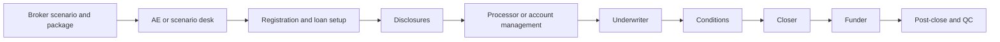
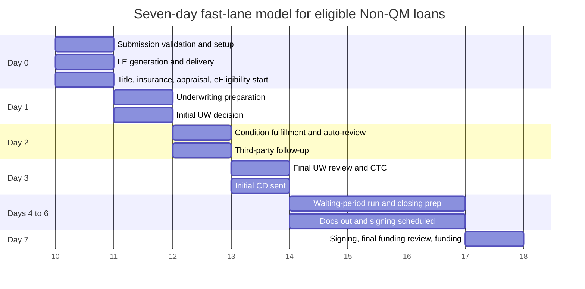

# Non-QM Wholesale Loan Operations Report

## Executive summary

A one-week close is realistic only if it is defined narrowly and managed rigorously: **eligible Non-QM loans should target seven calendar days from complete broker submission to funding, excluding documented external delays and respecting statutory disclosure timing**. That definition matters because Non-QM loans are still subject to the federal Ability-to-Repay rule, and TRID still requires the borrower to receive the initial Closing Disclosure at least three business days before consummation, with a new three-business-day waiting period for certain material changes. In other words, a seven-day close is not a faster version of a legacy mortgage workflow; it requires a different operating model built around **parallel execution, early readiness checks, and strict exception control**. citeturn9view1turn9view0turn24view0

Public wholesale lender materials show that the current market still operates in departmental stages with explicit turn-time queues for disclosure, underwriting, account management, closing, and funding. Acra publishes one to two business days for initial disclosures, two to three business days for initial underwriting, one business day for account-management review of conditions, one day for the initial CD, and one day for final closing-package review; incomplete submissions are explicitly marked as “Extended.” theLender publishes one-day setup, one-day Non-QM new underwriting decisions, one-day condition review, one- to two-day docs-out, and one-day funding review. Those benchmarks are not slow because any single worker is inefficient; they are slow because the system is segmented into handoffs and queues. citeturn22view0turn22view2turn15view1turn22view4turn22view5

The strongest evidence on what improves operational performance comes from agency and standards bodies rather than lender marketing. Freddie Mac’s 2025 update found that lenders maximizing its digital capabilities could save **up to $1,700 per loan** and shorten production timelines by **five days**, while its earlier quality study found materially lower defect rates for loans using digital tools, including combinations that were **four times less likely** to produce defects than loans without those offerings. Fannie Mae’s QC guidance, meanwhile, requires lenders to define quality standards, target defect rates, prefunding and post-closing review processes, and corrective-action loops, and it explicitly encourages lenders to use digital environments, OCR, and stored data to improve QC efficiency. citeturn10view5turn10view4turn13view2turn13view3

The practical implication is straightforward: the fastest sustainable Non-QM operation is an **event-driven, exception-based manufacturing system**. Routine collection, validation, routing, reminders, calculations, and status updates should be automated. Licensed origination activities, credit and policy judgment, exception approval, compliance interpretation, and fund release should remain under authorized human control. The target operating model should therefore move human work away from “touch every file at every stage” and toward “intervene only when the system detects ambiguity, risk, or policy exceptions.” That approach is consistent with current mortgage workflow technology, MISMO lifecycle standards, and the legal distinction between mortgage-loan-origination activities and purely administrative or clerical tasks. citeturn14view7turn11view6turn10view0turn10view2

## Current-state workflow and why it breaks

The standard Non-QM wholesale workflow is still recognizable across public lender portals, forms, turn-time pages, and product matrices: broker approval, scenario and pricing, registration, loan setup, disclosures, processing or account management, underwriting, condition review, closing, funding, and post-close review. What changes from lender to lender is not the basic sequence, but the volume of auxiliary forms, calculators, matrix checks, and side-channel coordination required to move the file. Acra’s broker resources include initial-submission forms, condition forms, broker-approval forms, and product-specific artifacts; theLender publishes separate Non-QM submission forms, closing-disclosure request sheets, CD/doc orders, pricing policies, condition-related forms, and portal guidance for submission and monitoring; Angel Oak and Deephaven publish program families that span DSCR, bank statements, P&L, 1099, ITIN, foreign-national, asset qualifier, and full-doc variants. That breadth is commercially valuable, but operationally it multiplies exceptions, documentation paths, and failure modes. citeturn9view8turn22view6turn22view7turn20view1turn20view2turn20view3

The public turn-time pages make the hidden operational problem visible: the file is managed as a set of **departmental queues**, not as a continuous flow. Acra lists distinct queues for disclosure processing, bank-statement prescreen, initial underwriting, suspense review, second-sign review, condition review, account-management review, appraisal review, closing, and funding. theLender similarly isolates setup, new underwriting decision, underwriting condition review, docs out, and funding review. This queue-based design inherently creates idle time between stages, even when upstream and downstream teams are both available capacity-wise, because progression depends on assignment, cutoffs, and re-entry into the next queue. citeturn22view0turn22view1turn15view1

### Current handoffs and failure points

| Stage | Common handoff | Typical current artifacts | Main failure mode |
|---|---|---|---|
| Broker to AE | Scenario, pricing, broker approval | Matrix checks, pricing tools, approval package | Scenario ambiguity, wrong product path |
| AE to registration/setup | Submission completeness | Submission form, cover sheet, portal upload | Missing forms or inconsistent data |
| Setup to disclosures | TRID trigger and fee package | Loan Estimate inputs, intent-to-proceed workflow | Delayed LE, wrong fees, versioning errors |
| Disclosures to processing | Doc collection and third-party orders | Portal docs, borrower reminders, vendor orders | Incomplete file enters active workflow |
| Processing to underwriting | “UW-ready” package | Income worksheets, narratives, conditions cover | Hidden defects surface too late |
| Underwriting to conditions | Conditional approval | Free-text conditions, guideline notes | Unclear owner, duplicate asks, rework |
| Conditions to closing | CTC and balancing | CD request, fees, title/settlement data | Late fee changes, redisclosures |
| Closing to funding | Signed-file and funding review | Closing package, signatures, wiring controls | Missing signatures, term variance |
| Funding to post-close | Shipping and investor delivery | Final docs, trailing docs, QC package | Data mismatch, suspense, cure work |

This table is a synthesis of public wholesale lender resources and turn-time pages, CFPB disclosure timing rules, and the operating controls embedded in Fannie Mae and Freddie Mac quality guidance. citeturn22view0turn22view6turn24view0turn13view2turn9view3

The root causes of delay are highly consistent across those sources. **Incomplete submissions** are the most obvious: Acra explicitly states that incomplete package submission and incomplete portal file submission extend the clock. **Alternative-documentation complexity** is the second: Non-QM programs often qualify borrowers using bank statements, asset depletion, P&L, 1099, DSCR, or property cash flow rather than standard wage income, which increases the need for document coverage checks, narrative support, and calculation traceability. **Data integrity and QC overhead** are the third: Fannie Mae requires all data entered into DU to be verifiable and requires lenders to maintain procedures that validate data integrity; its QC framework then requires systematic defect measurement and corrective action across production channels and third parties. citeturn22view0turn20view1turn20view0turn20view2turn13view1turn13view2

A fourth bottleneck is **closing variability**. Even if the lender is operationally ready, the closing path may still be hybrid, wet-sign, or eNote-enabled depending on investor policy, county recording capability, title-underwriter restrictions, settlement-agent readiness, and state eNotarization rules. MISMO created the e-Eligibility Exchange precisely because these factors are burdensome to research piecemeal and must be determined earlier and at the transaction level if digital closings are to scale. Fannie Mae’s 2025 lender survey underscores the point: only **22%** of respondents said they were then using eNotes for most loans, although **62%** expected to use eNotes within two years; the most-cited benefits were improved operational efficiency, enhanced borrower experience, and faster funding. citeturn11view5turn10view3turn10view6

## Future-state operating model

The optimal model is **event-driven and exception-based**. Work should not move because a human remembered to open a queue; it should move because a machine-detectable event changed the file’s state. ICE’s task-based workflow language is useful here: lenders can “orchestrate, delegate and automate” tasks across any user, at any stage of the lifecycle, and complete tasks in parallel rather than waiting for each stage to finish before the next can begin. MISMO’s Life of Loan and Reference Model provide the standardized lifecycle and data vocabulary needed to build that orchestration without hard-coding every handoff as a one-off workflow. citeturn14view7turn9view5turn16view0

In practice, this means the system should distinguish four categories of work. Deterministic rules belong to the rules engine. Repetitive administrative work belongs to workflow automation. Probabilistic extraction or classification belongs to AI or document intelligence, with confidence thresholds and audit evidence. Material credit, compliance, or policy decisions belong to authorized humans. That division reflects both current platform capabilities and mortgage governance realities: vendor documentation shows that application prefill, document collection, red-flag detection, workflow automation, and integrated verification are already feasible; at the same time, CFPB rules preserve strict requirements around who is acting as a loan originator and how those individuals are compensated, qualified, and identified. citeturn11view1turn14view6turn10view2turn10view0

### Current and optimal work by role

| Role | Current work in many shops | Human work to retain | Automation-first work | Governance note |
|---|---|---|---|---|
| Broker | Scenarioing, document chase, status calls, resubmissions | Borrower advice, expectations, relationship management, borrower-side issue resolution | Dynamic checklist, borrower reminders, secure upload, status updates, missing-item detection | Consumer-facing origination activities should remain under licensed human control where required |
| Account Executive | Pricing support, broker triage, status relay, exception lobbyist | Broker relationship, scenario structuring, escalation, training | Scenario intake, product-fit precheck, pipeline alerts, broker-quality scorecards | Role design varies by lender and state; if the role crosses into taking applications or negotiating terms, licensing rules apply |
| Registration and setup | Manual boarding, duplicate entry, assignment, milestone creation | Exception review for data conflicts or fraud flags | Auto-create loan, map data, classify docs, assign workflows, trigger services | Administrative/clerical tasks can be system-handled |
| Disclosure desk | Fee assembly, doc prep, redisclosure tracking | Changed-circumstance judgment, compliance exceptions | LE/CD generation, timing clocks, delivery evidence, version control | TRID timing and tolerance logic require auditable controls |
| Processor or account manager | Checklist management, status coordination, doc chasing, condition routing | Exception resolution, broker coaching, suspicious-doc review, third-party escalation | Missing-item requests, follow-ups, doc validation, condition package preparation | Processor should become an exception manager, not a status clerk |
| Underwriter | Manual stare-and-compare, free-text conditions, repeated re-review | Credit judgment, layered-risk assessment, policy exceptions, final decision | Summaries, calculation support, fraud flags, draft conditions, evidence linking | Final material decision should remain under authorized human governance |
| Closer | Fee balancing, document prep, package assembly, reschedules | Exception balancing, vesting or legal anomalies, settlement negotiation | Closing-readiness checks, CD/doc package generation, signature inventory | Should support wet, hybrid, and eClosing paths |
| Funder | Final package review, funding conditions, wire prep | Final release of funds, suspicious-change escalation, override control | Signature/term validation, funding-readiness checklist, wire instruction verification | Human release remains the safest control point |
| Post-close and QC | Shipping review, trailing docs, suspense cures | Defect analysis, corrective action, investor escalation | File inventory, data reconciliation, trailing-doc tracking, investor package prep | QC should feed root-cause remediation, not just after-the-fact inspection |

The control boundary in the last column is important. Under the SAFE Act regulation, a mortgage loan originator is an individual who takes a residential mortgage loan application and offers or negotiates terms for compensation or gain, while purely administrative or clerical tasks are excluded. CFPB’s loan-originator rule resources also highlight the continuing rules around compensation, steering, qualifications, and identification. That means Origina can automate or deskill large amounts of administrative work, but should not “fully automate” consumer-facing origination or delegated decision authority in a way that bypasses licensing, qualification, or accountability requirements. citeturn10view0turn10view2

A useful design principle is to define each handoff as a **state transition with evidence**, not a memo or email. For example, “UW-ready” should not mean “processor thinks it looks good.” It should mean all required documents for the chosen qualification path are present, machine validation has run, unresolved hard-stop exceptions are zero, third-party orders are initiated, discrepancies are enumerated, and the file has a clear recommendation and evidence package. That evidence-first approach matches Fannie Mae’s insistence on verifiable data and structured QC, and it reduces the rework loop that appears when underwriters are asked to identify basic completeness defects that should have been caught earlier. citeturn13view1turn13view2

## Controls, SLAs, telemetry, and dashboards

The single most important measurement change is to split cycle time into **gross elapsed time** and **controllable time**. Gross time runs from complete broker application or complete submission to funding. Controllable time excludes documented external waiting categories such as appraisal delivery delays, title defects outside lender control, county recording constraints, insurance lag, or borrower non-response. TRID timing and eClosing eligibility also deserve their own categories, because they are real constraints but operationally distinct from lender-internal delay. If you do not separate those clocks, operations teams will optimize the wrong thing and “improve” by pushing work out of sight into vendor or borrower wait states. citeturn24view0turn11view5

Public benchmarks show why the internal SLA design should be tighter than current departmental norms. If the market openly treats one to three business days as acceptable for disclosures, underwriting, conditions, docs, and funding review, then a one-week close is impossible unless the lender’s internal target times are measured in **minutes or hours**, not in days, and unless several streams run in parallel. Freddie Mac’s cost-to-originate updates reinforce that point by linking greater digital capability usage to both shorter timelines and lower cost. citeturn22view0turn15view1turn10view5

### Proposed internal SLA table

| Event | Proposed target | Clock type |
|---|---:|---|
| Submission validation after broker click | 5 minutes | Controllable |
| Loan setup and workflow assignment | 5 minutes | Controllable |
| Initial missing-item notice | 10 minutes | Controllable |
| Loan Estimate generation after TRID trigger | 15 minutes | Controllable |
| Initial processor exception review | 2 business hours | Controllable |
| Initial underwriting decision for fast-lane loans | Same day or ≤ 8 business hours | Controllable |
| Condition package delivery after approval | 15 minutes | Controllable |
| Routine uploaded-condition auto-validation | 5 minutes | Controllable |
| Processor review of failed or ambiguous conditions | 2 business hours | Controllable |
| Underwriter condition re-review | 4 business hours | Controllable |
| CTC to initial CD or closing action | 1 hour | Controllable |
| Balanced CD to docs out | 2 business hours | Controllable |
| Signed-package funding review | 2 business hours | Controllable |
| Funding after final approval and cutoff satisfaction | Same business day | Controllable |

These targets are design recommendations rather than market averages. They are intentionally more aggressive than public lender queue times because the goal is to build a **fast lane**, not to mirror existing departmental clocks. The targets must still be validated in pilot against TRID timing, closing-channel availability, and product-specific readiness rules. citeturn24view0turn22view0turn15view1

### Required telemetry events

| Event family | Example events | Why it matters |
|---|---|---|
| Submission | loan_created, package_uploaded, completeness_scored, submission_rejected | Distinguishes “submitted” from “ready” |
| Disclosure | trid_triggered, LE_sent, intent_to_proceed_received, CD_sent, redisclosure_triggered | Protects statutory timing and auditability |
| Processing | checklist_generated, missing_item_requested, borrower_response_received, vendor_ordered | Measures avoidable waiting and request quality |
| Underwriting | uw_ready, initial_decision, condition_created, exception_requested, final_decision | Measures first-pass yield and touch count |
| Document intelligence | doc_classified, page_missing, period_incomplete, extraction_confidence_below_threshold | Shows where AI and OCR fail or save work |
| Collateral and third parties | appraisal_ordered, appraisal_received, title_received, insurance_received, eEligibility_evaluated | Separates internal from external delay |
| Closing and funding | CTC_issued, package_generated, signatures_missing, funding_hold_created, funds_released | Protects closing speed and funding control |
| QC and shipping | postclose_reconciled, trailing_doc_missing, investor_suspense, defect_confirmed | Feeds corrective action back upstream |

These telemetry objects should be modeled as first-class data, not log-only artifacts. Fannie Mae’s QC framework requires documented standards, measured defect rates, and corrective action; its data-integrity guidance requires complete and accurate data that is verifiable. MISMO’s Reference Model, YAML/OpenAPI artifacts, and Life of Loan structure provide the right backbone for representing those events consistently across systems and vendors. citeturn13view2turn13view1turn16view0turn9view5

### KPI dashboard mockup

| Executive panel | Illustrative fields |
|---|---|
| Throughput | Loans funded this week, fast-lane volume, pull-through, funded volume by broker |
| Cycle time | Median gross time, median controllable time, p75 and p90, setup-to-UW, UW-to-CTC, CTC-to-funding |
| Quality | First-pass approval, preventable conditions per loan, condition reopen rate, post-close defect rate, investor suspense rate |
| Automation | Straight-through setup rate, auto-validated conditions, automated communications, automation override rate, document-confidence failure rate |
| Service | Broker SLA hit rate, borrower-response lag, status-only inquiries avoided, vendor SLA hit rate |
| Risk | Exceptions per loan, fraud-alert rate, redisclosure incidents, funding holds, adverse QC findings |

A role-specific dashboard should then roll those metrics down into daily work. Processors should see only files that are blocked, exceptioned, or aging past SLA. Underwriters should see decision-ready files ordered by close risk and missing evidence count. Closers should see a readiness view combining CD timing, eEligibility, balancing status, settlement contacts, and signing readiness. That is the practical difference between a **work list** and a **flow-control system**. citeturn14view7turn11view5turn13view2

## Seven-day fast lane and validation scenarios

A credible fast lane should start with eligibility rules, not optimism. The best pilot population is not “all Non-QM files”; it is the subset with the most controllable documentation paths. Deephaven’s DSCR product, for example, qualifies on subject-property rental cash flow without employment or income documentation, while its Expanded-Prime product and other bank-statement solutions introduce greater borrower-document complexity. theLender’s own public materials similarly separate asset qualifier, bank-statement qualifier, and other Non-QM variants, which is a reminder that qualification method should drive workflow design. citeturn20view2turn20view3turn20view0

A fast-lane loan should meet all of the following before the seven-day clock starts: approved broker; valid TRID-triggering application where applicable; product path confidently identified; required documents present for that qualification path; no unresolved hard-stop fraud alert; title, insurance, and collateral orders kicked off on day zero; settlement contact identified; and a closing channel identified as wet, hybrid, or eClosing based on actual transaction-level eEligibility. eClosing should be enabled where possible, but not assumed: Fannie Mae’s survey shows growing adoption, not universal adoption, and MISMO’s e-Eligibility framework exists because settlement, recording, title, and counterparty constraints remain variable. citeturn24view0turn11view5turn10view3turn10view6

This timeline assumes the initial CD can be issued early enough to satisfy the three-business-day rule and that no redisclosure-triggering APR, product, or prepayment-penalty changes occur later. If those changes occur, the fast lane should automatically reclassify the file, because the rule itself creates a new waiting period. citeturn24view0

### Validation scenarios and measurable outcomes

| Scenario | Setup | Expected system behavior | Pass metrics |
|---|---|---|---|
| Complete DSCR purchase | Broker-approved DSCR file with rent support, clean title, timely appraisal | Straight-through setup, same-day UW-ready packet, minimal conditions, early CD | ≤ 8 human touches, Day-3 CTC, Day-7 funding |
| Bank-statement self-employed | 12 or 24 months statements, ownership docs, transfer noise, large deposits | Coverage and page checks, deposit extraction, transfer suppression, explanation prompts, traceable income calc | ≥ 95% statement-page completeness detection, ≤ 1 manual recalc, income traceability 100% |
| Incomplete submission | Missing authorization, missing statement page, absent entity doc | File remains “submitted-incomplete,” single consolidated ask issued, no UW SLA starts | Missing-item detection ≥ 99%, broker notice ≤ 10 min, zero premature UW-ready transitions |
| Guideline mismatch | Product requested but LTV or property type ineligible | Hard-stop eligibility failure, alternative product suggestions, AE escalation only if unresolved | False approval rate = 0, alternative-path recommendation ≤ 1 min |
| Redisclosure trigger | APR or product change after CD | Changed-circumstance detection, corrected CD path, waiting-period recalculation | 100% correct redisclosure classification, zero missed waiting-period resets |
| Condition upload | Broker uploads doc intended to clear an income or title condition | Auto-match to condition, machine validation on dates/pages/criteria, only failures routed to human | ≥ 85% first-pass auto-match, false-clear rate < 1%, processor touches reduced by 50% vs baseline |
| Vendor delay | Appraisal or title exceeds promised SLA | Delay coded as external, close-risk recalculated, broker notified, vendor escalation triggered | External-delay attribution accuracy ≥ 95%, broker update within 15 min of breach |
| Funding discrepancy | Signed docs differ materially from authorized terms or required signatures missing | Automatic funding hold, variance explanation, override restricted to authorized human | 100% hold on material variance, unauthorized funding = 0 |
| eClosing ineligible | County/title/settlement path prevents digital closing | Auto-fall back to hybrid or wet path without losing readiness data | Correct channel selection ≥ 99%, no manual rediscovery of eEligibility factors |
| Post-close data mismatch | Final docs do not match LOS data or investor delivery fields | Auto-reconciliation flags mismatch and opens corrective workflow | Investor suspense rate reduced, cure turnaround captured, mismatch closure within SLA |

These scripts intentionally operationalize regulatory and market realities rather than generic QA. The redisclosure script is anchored to TRID timing, the eClosing script is anchored to transaction-level eEligibility, and the product scripts reflect the fact that DSCR, bank-statement, and asset-based Non-QM files follow different documentation and calculation paths. citeturn24view0turn11view5turn20view2turn20view0

## Automation priorities, platform design, and implementation roadmap

The automation program should be sequenced by **determinism, volume, regulatory risk, and dependency complexity**. Freddie Mac’s origination-cost and defect studies show why: the highest-return capabilities are the ones that eliminate repetitive work, shorten timelines, and prevent defects before they propagate. STRATMOR’s 2024 digital-innovation work similarly found that lenders already have their strongest adoption in online disclosures, borrower uploads, and dynamic applications, while more advanced operational automation is still uneven. That pattern suggests a practical implementation order: build the digital foundation first, then automate structured fulfillment, then add AI-assisted judgment support where evidence and governance are strong enough. citeturn10view5turn10view4turn14view3

### Prioritized automation matrix

| Tier | Capability set | Example functions | ROI potential | Effort | Why this tier |
|---|---|---|---|---|---|
| Tier 1 | Deterministic workflow automation | Loan creation, data mapping, doc classification, missing-page checks, reminders, status updates, task routing, SLA clocks, audit trail | Very high | Low to medium | High volume, low ambiguity, immediate cycle-time payoff |
| Tier 1 | Disclosure and timing automation | LE/CD generation, delivery evidence, intent-to-proceed capture, redisclosure calendar, tolerance alerts | Very high | Medium | Strong rules, high compliance value, major source of avoidable delay |
| Tier 1 | Third-party orchestration | Appraisal/title/insurance ordering, SLA tracking, broker notifications, close-risk updates | High | Medium | Prevents invisible external-delay drift |
| Tier 2 | Decision support and structured verification | Bank-statement extraction, DSCR calculators, asset validation, fraud flags, draft conditions, condition auto-match | High | Medium to high | Strong ROI, but needs confidence thresholds and human review loops |
| Tier 2 | Closing and funding validation | Signature completeness, package balancing checks, funding-readiness engine, final term variance checks | High | Medium | High leverage close to funding, but mistakes are consequential |
| Tier 3 | Human-governed AI assistance | Scenario recommendations, underwriting summaries, exception memos, QC root-cause suggestioning | Medium to high | High | Valuable, but governance and calibration matter more than speed |
| Tier 3 | Human decision authority | Credit decisions, policy exceptions, fraud determinations, fund-release overrides | Risk protection, not pure ROI | High control, lower automation | Should remain human-owned with system support |

For external directional data points, vendor materials show that lenders report meaningful savings when workflow automation is implemented well: Blend cites customer-reported cycle-time reductions of **7.3 days** and average ROI of **$520 per loan**, while its platform materials claim **16+ hours per loan** in automated workflow savings. Those numbers should not be treated as universal benchmarks, but they reinforce the agency evidence that routine automation pays for itself when it is tied to measurable process redesign rather than UI modernization alone. citeturn14view5turn14view4

### Required system services and data-model implications

| Service | Purpose | Data-model implication |
|---|---|---|
| Workflow orchestration engine | Event-driven task routing and parallel work | Explicit state machine, task objects, SLA timers, dependency graph |
| Eligibility and guideline service | Product fit, hard stops, alternatives | Versioned rule sets, explainable reason codes, product overlays |
| Document intelligence service | Classification, extraction, coverage checks | Document entity model, page-level metadata, confidence scores, evidence links |
| Calculation engine | DSCR, asset depletion, bank-statement income, fees | Reproducible formulas, source lineage, assumption registry |
| Disclosure and compliance service | TRID clocks, LE/CD versions, changed-circumstance logic | Disclosure version objects, timing ledger, tolerance events |
| Condition management service | Structured conditioning and evidence matching | Condition schema with owner, criteria, status, reopen reason |
| Partner and vendor integration layer | Appraisal, title, insurance, settlement, credit, pricing | Canonical partner events, request/response history, SLA attribution |
| Closing channel service | Wet vs hybrid vs eClosing determination | eEligibility object, county/title/settlement constraints, channel history |
| Audit and QC service | Prefunding and post-close feedback loop | Defect taxonomy, severity, target rates, corrective-action linkage |
| Analytics and telemetry platform | Dashboards, cohorts, bottleneck analysis | Event store, fact tables for by-loan, by-role, by-broker, by-stage metrics |

MISMO’s current standards stack is the clearest blueprint for those services. The Life of Loan gives a shared process structure; the Reference Model provides XML, YAML/OpenAPI, JSON Schema, and logical data dictionary artifacts; SMART Doc standards provide a way to bind data to documents for automated verification; and MISMO’s eMortgage and e-Eligibility work addresses digital closing integrity and variability. Together, they support a platform that is configurable and auditable instead of dependent on brittle, lender-specific workflow scripts. citeturn9view5turn16view0turn16view1turn16view2turn16view3turn11view5

Digital closing support should be built in from the start, but with graceful fallback. Freddie Mac and Fannie Mae both define eClosings as electronically executed closings and continue to support hybrid models. Fannie Mae’s survey data shows adoption is growing, and Fannie’s Better Mortgage case study argues that eNotes can improve efficiency and reduce delays caused by lost paperwork; Freddie Mac also notes that electronic documents can start as early as the initial application and disclosures, not just at the closing table. The right architectural implication is not “assume all files are eClose-ready,” but “persist closing-channel readiness as structured data from the beginning.” citeturn10view6turn11view7turn10view3turn11view8

### Actionable implementation roadmap

| Phase | Milestone window | Core deliverables | Exit criteria |
|---|---|---|---|
| Foundation | 0–90 days | Canonical loan state machine; event taxonomy; broker submission portal; completeness scoring; audit trail; KPI baseline; current-state time study | Every loan state/time transition captured; baseline gross and controllable cycle time live |
| Straight-through intake | 90–180 days | Auto-setup, doc classification, dynamic checklist, LE automation, intent-to-proceed capture, vendor-order orchestration | ≥ 90% straight-through setup; LE median under 15 minutes after trigger |
| Exception-based fulfillment | 180–300 days | Structured conditions, underwriting prep packet, calculation engine for DSCR and bank-statement lanes, role dashboards | Processor touches down materially; first-pass approval and condition quality improving |
| Close and fund fast lane | 300–420 days | eEligibility service, closing-readiness engine, CD/workflow integration, funding validation, post-close reconciliation | Fast-lane pilot delivering consistent Day-7 results on eligible files |
| Scale and govern AI | 420+ days | AI assistance for scenarioing, explanation drafting, QC intelligence, policy governance using mortgage AI controls and audit rules | AI override rate, defect impact, and fairness/compliance review all within policy |

This sequencing is deliberately conservative on AI and aggressive on instrumentation. STRATMOR’s data shows that many lenders still have better adoption of front-end digital basics than of deeper workflow automation, which means the biggest near-term value often comes from fixing the operating substrate first. MISMO’s 2026 FRAME launch also points in the same direction: AI in mortgage should be governed as a production system, not treated as a shortcut around process design and accountability. citeturn14view3turn7search1

### Pilot targets and success metrics

| Metric | Pilot target | Scale target |
|---|---:|---:|
| Fast-lane loans funded within 7 calendar days | 70% | 90% |
| Median controllable time from complete submission to CTC | ≤ 3 business days | ≤ 2 business days |
| Straight-through setup | 85% | 95% |
| LE generation after TRID trigger | ≤ 15 minutes median | ≤ 10 minutes median |
| Initial UW decision on fast-lane files | ≤ 8 business hours | ≤ 4 business hours |
| Preventable conditions per loan | < 1.5 | < 0.8 |
| First-pass condition clearance | 75% | 85% |
| Status-only inbound inquiries | -50% vs baseline | -70% vs baseline |
| Human touches per standard fast-lane loan | -35% vs baseline | -60% vs baseline |
| Post-close material defect rate | < 2% | < 1% |
| Funding holds caused by missing signatures/variance | < 1% | < 0.5% |
| Broker satisfaction with operational transparency | Positive trend from baseline | Top-quartile internal target |

The pilot should begin with a narrow mix, ideally DSCR and the cleanest bank-statement lanes, because those products let the lender prove the mechanics of completeness checking, structured conditions, closing coordination, and rapid funding before taking on the heavier judgment burden of more layered consumer Non-QM files. Success should be declared only if speed improves **without** increasing defects, redisclosure misses, or funding-risk incidents. That is exactly the lesson embedded in Fannie Mae’s QC framework and Freddie Mac’s digital-quality studies: fast operations that create downstream defects are not actually efficient. citeturn20view2turn20view3turn13view2turn10view4